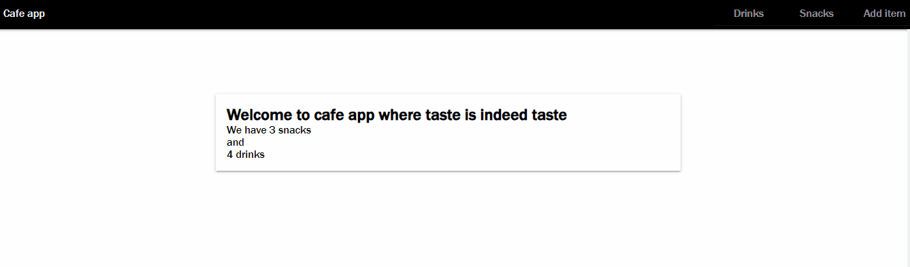

# CAFE APP

A snacks/drinks cafe application written to demonstrate basic React concepts.


## Description

This application is built to demonstrate some of React concepts while adhering to best practices of the framework. Some of the concepts demonstrated are state management in functional components, basic client side routing using the react-router-dom package, basic form handling in React.

## Getting Started

### Prerequisites
- [Nodejs](https://nodejs.org/en): This avails the npm package manager using to install the dependencies of the project.
- Code editor like [VScode](https://code.visualstudio.com/)

### Dependencies

* [React-router-dom](https://reactrouter.com/en/main)
* [Axios](https://axios-http.com/docs/intro)
* [Concurrently](https://www.npmjs.com/package/concurrently)
* [json-server](https://github.com/typicode/json-server/tree/v0)

### Installing
* Clone this repository to your local development environment
* Navigate to the directory where the repository is cloned
* Run the following commands:
  - To install the dependencies of the project
    ```
    npm install or npm i
    ````
  - To start the development server both the backend and the frontend concurrently
    ```
    npm start
    ```


### Executing program
* Open this [http://localhost:5173/](http://localhost:5173/) in the browser. 


## Help
If you have a suggestion, consider adding it to [issues](https://github.com/vanheaven-ui/todo-app-erdhas/issues) tab in the repository.

## Authors

Ezekiel Mworekwa  
[Github](https://github.com/vanheaven-ui) |
[linkedIn](https://linkedin.com/vanheaven)

## You can leave a ⭐ on the repository if you like it.